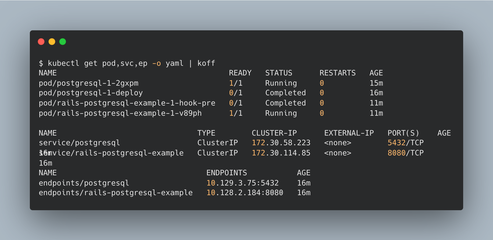

# `koff`
[](https://github.com/gmeghnag/koff/actions?query=workflow%3ABuild)



`koff` is a command-line tool that processes Kubernetes `yaml|json` manifests and returns their appropriate tabular format, as well as `yaml` or `json`.

## **¿What?**
It allows you to process Kubernetes resources in `yaml` or `json` format, from either file or piped input or etcd snapshot file.<br />
It reads input, performs the specific filter operations based on the flags and arguments (if provided), and writes the output in either tabular (as default), `json` or `yaml` format. 

## **¿Why?**
Helpful in conjunction with `kubectl` to take a "snapshot" of specific resources at that specific point in time and parse the same later on.

## **¿How?**
- Via piped input:
  ```
  $ cat resources.yaml | koff get pod/postgresql-1-2gxpm svc/postgresql
  NAME                     READY   STATUS    RESTARTS   AGE
  pod/postgresql-1-2gxpm   1/1     Running   0          15m

  NAME                 TYPE        CLUSTER-IP      EXTERNAL-IP   PORT(S)    AGE
  service/postgresql   ClusterIP   172.30.58.223   <none>        5432/TCP   16m
  ```
- Referencing the file to use via `koff use <resources>.yaml` before executing `koff`:
  ```
  $ koff use resources.yaml
  $ koff get pod/postgresql-1-2gxpm svc/postgresql
  NAME                     READY   STATUS    RESTARTS   AGE
  pod/postgresql-1-2gxpm   1/1     Running   0          15m

  NAME                 TYPE        CLUSTER-IP      EXTERNAL-IP   PORT(S)    AGE
  service/postgresql   ClusterIP   172.30.58.223   <none>        5432/TCP   16m
  ```
- Using an etcd snapshot to get the Kubernetes object contained in it:
  ```
  $ koff etcd inspect etcd_snap.db /kubernetes.io/pods/openshift-etcd/testocp-bqgqk-master-0-debug -o yaml
  apiVersion: v1
  kind: Pod
  metadata:
    annotations:
      debug.openshift.io/source-container: container-00
      debug.openshift.io/source-resource: /v1, Resource=nodes/testocp-bqgqk-master-0
    creationTimestamp: "1995-01-17T00:0:00Z"
    ...
    ...

  $ koff etcd inspect etcd_snap.db /kubernetes.io/pods/openshift-etcd/testocp-bqgqk-master-0-debug | koff
  NAME                                    READY   STATUS    RESTARTS   AGE
  pod/testocp-bqgqk-master-0-debug        0/1     Pending   0          22h

  ```

## Installation
### Using `go`
```
go install github.com/gmeghnag/koff 
```
### Download the latest binary
```
OS=Linux        # or Darwin
curl -sL "https://github.com/gmeghnag/koff/releases/latest/download/koff_${OS}_x86_64.tar.gz" | tar xzf - koff
chmod +x ./koff
```
### Build from source
```
$ git clone https://github.com/gmeghnag/koff.git
$ cd koff/
$ go install
```

## Upgrade
It's possible to upgrade the tool to the latest version by running `koff upgrade --to=latest`


